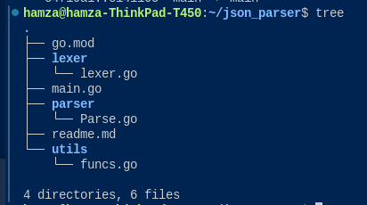

# JSON Parser Written from Scratch (JSON to Go Struct)

## Project Structure

The project consists of three main folders:

1. **lexer**: Contains the lexer, which takes an input string and outputs a slice (array) of tokens based on JSON rules.  
    The lexer tokenizes meaningful elements rather than every individual character.

2. **parser**: Responsible for syntactic analysis.  
    It uses simple loops and if-else logic to parse JSON quickly and map types to Go equivalents (e.g., `null` → `nil`).  
    Note: This does not involve building an AST as compilers usually do.

3. **utils**: Provides useful functions for type checking with Go's standard types.

The `main.go` file is the entry point for program execution.

_Code explanation will be provided later._